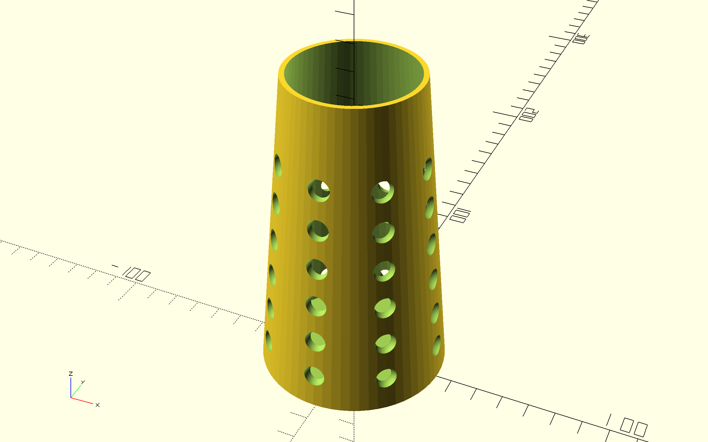
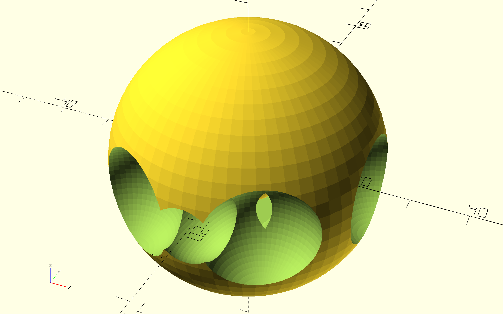

# CAD Portfolio

Some 3D models I've been working on in OpenSCAD. 
All models are fully parametric — dimensions and features can be adjusted by changing the variables at the top of each file.

---

## Voronoi-Inspired Vase

A tapered hollow vase with circular cutouts running around the body. 
I wanted to see how far I could push the lattice effect while keeping the walls structurally sound.

---

## Cat Toy Ball — designed for Shadow

A rollable ball with cutout windows and a small bell ball trapped inside.
Designed to be 3D printed — the holes are sized so a cat can bat it around without getting their paw stuck.

---

Tools used: OpenSCAD 2021.01# cad-portfolio
